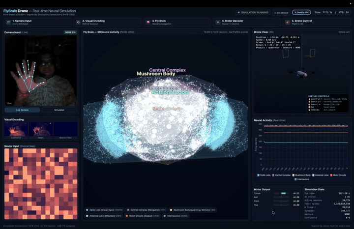
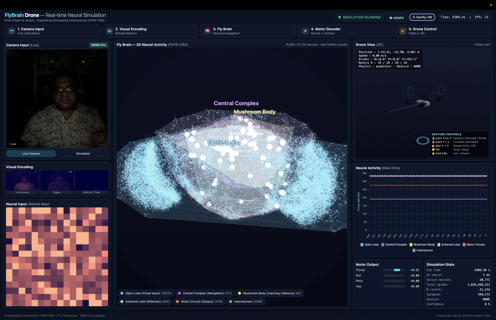

# 🧠🚁 FlyBrain Drone

> **A real fruit-fly brain, flying a drone — controlled by your hand, in real time.**

<p align="center">
  
  
  
  
  
</p>

FlyBrain Drone streams a **real map of the *Drosophila melanogaster* brain** (the
[FlyWire / FAFB v783 connectome](https://flywire.ai/) — ~100k neurons and their real
synaptic wiring) and uses it as the *computational substrate* that turns what you show
the camera into flight commands for a simulated quad-rotor. Your hand gestures become
"vision", the signal propagates through the actual neurons and synapses of the fly
brain, and the resulting neural activity is decoded into motor commands — all rendered
live in your browser.

<p align="center">
  
</p>

<p align="center">
  
</p>

<p align="center">
  <em>Vision → Visual encoding → Fly brain → Motor decoder → Drone flight</em>
</p>

```
📷 Camera  →  👁 Visual encoding  →  🧠 Fly connectome (LIF sim)  →  ⚡ Motor decoder  →  🚁 Drone
     ▲                                                                                        │
     └────────────────────────────  closed loop  ◄───────────────────────────────────────────┘
```

---

## ✨ What you get

- **Live 3D fly brain** — real FlyWire soma coordinates, neuropil hulls, and synaptic
  pathways that light up as signal pulses race between regions.
- **Hand-gesture flight control** — MediaPipe hand tracking in the browser; move the
  drone with intuitive finger poses (no controller needed).
- **A real quad-rotor sim** — DJI-Mavic-style drone with follow-cam, trajectory trail,
  gates, and a live HUD.
- **Real-time neural charts** — per-region firing rates, motor output bars, spike stats.
- **Neural sonification** — optionally *hear* the brain: region activity is mapped to
  live audio (🔊 toggle in the header).
- **Runs anywhere** — one Python command, or a single Docker container.

---

## 🚀 Quick start (clone & run in ~2 minutes)

You only need **Python 3.10+** and a modern browser (Chrome/Edge/Safari). The real
FlyWire connectome CSVs are already included in the repo, so there is **nothing to
download**.

```bash
# 1. Clone
git clone https://github.com/sandipan-ai95/flybrain_drone.git
cd flybrain_drone

# 2. Create an isolated environment
python -m venv .venv
source .venv/bin/activate           # Windows: .venv\Scripts\activate

# 3. Install (runtime deps only)
pip install -r requirements.txt
pip install -e .

# 4. Run the dashboard
python -m flybrain.server.dashboard_server
```

Now open **<http://127.0.0.1:8000/>** in your browser. Allow camera access, and
you're flying. ��

> 💡 **No webcam?** Click **"Simulated"** in the Camera Input panel — the drone will
> fly a scripted gesture sequence so you can see the whole pipeline without a camera.

### 🐳 Or run with Docker (no Python setup at all)

```bash
docker build -t flybrain-drone .
docker run --rm -p 7860:7860 flybrain-drone
# then open http://127.0.0.1:7860/
```

---

## 🖐️ Gesture controls

Detection uses **finger count** as the primary signal (very reliable) and the
**pointing direction** to pick the specific move. An on-screen legend is shown in the
Drone View panel.

| Pose | Direction | Action |
|------|-----------|--------|
| ☝️ **1 finger** (index) | point ↑ / ↓ / ← / → | **Ascend / Descend / Strafe** left-right |
| ✌️ **2 fingers** (peace) | point ↑ / ↓ | **Forward / Backward** |
| 🤟 **3 fingers** | lean ← / → | **Rotate** CCW / CW |
| ✊ **Fist** | — | **Hover** (stop) |
| 🖐️ **Open hand + thumb** | hold ~0.8 s | **Arm / Disarm** the drone |

The drone starts **DISARMED**. Show an open hand (thumb splayed) and hold for ~0.8s to
**arm** it, then use the flight poses. Hold the open hand again to disarm.

---

## 🧩 How it works

The system is a genuine closed control loop inspired by biological sensorimotor
processing:

1. **Camera → visual encoding** (`vision/`) — the browser captures your hand, extracts
   retinal-style features (luminance, edges, motion), and classifies a gesture.
2. **Gesture → sensory current** (`vision/stimulus.py`) — the recognised gesture injects
   current into the matching sensory sub-population of the connectome.
3. **Neural propagation** (`neuroscience/`) — a **Leaky Integrate-and-Fire (LIF)**
   network runs on the *real FlyWire connectivity matrix*, propagating spikes through
   real synapses at 1 ms resolution.
4. **Motor decoding** (`decoding/`) — a population decoder reads the sensory/descending
   populations and outputs thrust / roll / pitch / yaw + direct kinematic commands.
5. **Drone physics** (`drone/`) — a quad-rotor simulator integrates the command and
   updates the drone state, which feeds the next frame.

State is streamed to the browser over a **WebSocket** at ~15 fps; the browser renders
everything with **Three.js** and **Chart.js**.

---

## ⚠️ Scientific honesty (please read)

This is a **research / educational** project, **not** a biologically faithful
simulation of a living fly. It combines:

- ✅ **Real structural connectivity** — the FlyWire FAFB v783 connectome (neurons,
  synapses, 3D coordinates, cell classes). This part is measured, real data.
- 🧪 **Modelling conventions** we add on top, each documented in its module:
  - a generic **LIF** neuron model (swappable via the `NeuralModel` interface),
  - a **hand-crafted visual encoder** mapping pixels → sensory-neuron currents,
  - a **motor decoder** that reads population activity → drone commands.

The mapping of gesture channels onto FlyWire cell types is a *computational convention*,
not a claim about fly biology. Every assumption lives next to the code that makes it.

---

## 📁 Project layout

```
flybrain_drone/
├── README.md                # you are here
├── PRODUCT.md               # vision, use cases, roadmap
├── CONTRIBUTING.md          # how to contribute
├── LICENSE                  # MIT
├── Dockerfile               # one-container deploy
├── requirements.txt         # runtime deps (server)
├── pyproject.toml           # package + optional extras
├── docs/media/              # demo GIF + screenshot
├── data/raw/flywire/        # real FlyWire FAFB v783 CSVs (included)
├── configs/                 # YAML experiment configs
├── src/flybrain/
│   ├── connectome/          # FlyWire loader, graph, annotations
│   ├── neuroscience/        # LIF neuron model, spiking simulator
│   ├── vision/              # gesture recognition, stimulus encoding
│   ├── decoding/            # population motor decoder
│   ├── drone/               # quad-rotor physics + simulator
│   ├── visualization/       # brain layout, dashboard helpers
│   ├── server/              # FastAPI + WebSocket dashboard  ← main app
│   │   └── static/index.html   # the entire browser dashboard
│   └── demo/                # headless closed-loop demo
├── tests/                   # pytest suite
└── notebooks/               # exploration
```

---

## 🛠️ Common commands

```bash
# Run with the real FlyWire brain (default), pick a port
python -m flybrain.server.dashboard_server --port 8000

# Use the tiny synthetic connectome (fast, no data needed)
python -m flybrain.server.dashboard_server --connectome gesture

# Cap neuron count for lower-end machines
python -m flybrain.server.dashboard_server --max-neurons 6000

# Headless closed-loop demo (no browser)
python -m flybrain.demo.hover_loop --steps 500

# Run the tests
pip install -e ".[dev]" && pytest -q
```

### Server options

| Flag | Default | Description |
|------|---------|-------------|
| `--connectome` | `flywire` | `flywire` (real brain) or `gesture` (synthetic) |
| `--max-neurons` | `12000` | Upper bound on simulated neurons |
| `--host` | `127.0.0.1` | Bind address |
| `--port` | `8000` | Port |
| `--fps` | `15` | State stream rate |
| `--physics` | `quadrotor` | `quadrotor` or `simple` |

---

## 🧪 Tech stack

- **Backend:** Python, FastAPI, Uvicorn, WebSockets, NumPy, SciPy
- **Neural sim:** custom LIF spiking network over a sparse connectome matrix
- **Frontend:** Three.js (3D), Chart.js (plots), Tailwind (UI), MediaPipe Hands (gesture)
- **Data:** FlyWire / FAFB v783 connectome (CC BY 4.0)
- **Deploy:** Docker, Hugging Face Spaces (SDK: Docker)

---

## �� Troubleshooting

| Symptom | Fix |
|--------|-----|
| Page is blank / "connection refused" | Make sure the server is running and open the exact URL it prints. |
| Camera not detected | Grant browser camera permission; on macOS use Chrome/Safari. Try the **Simulated** button. |
| Drone won't move | You must **Arm** first: show an open hand (thumb out) and hold ~0.8s. |
| Everything is slow | Lower neurons: `--max-neurons 6000`, and close other GPU-heavy tabs. |
| Gestures feel jumpy | Ensure good lighting and keep your whole hand in frame. |

---

## 📚 Dataset & attribution

- **FlyWire / FAFB v783** — full adult fly brain connectome, © the FlyWire consortium
  (Dorkenwald et al., 2024), released under **CC BY 4.0**. <https://flywire.ai/>
- The included CSVs are the public release; see `src/flybrain/data/fetch_flywire.py` for
  the download tool and source URLs.

---

## 🤝 Contributing

Contributions are welcome! See [`CONTRIBUTING.md`](./CONTRIBUTING.md). Good first areas:
new gestures, better visual encoders, learned motor decoders, and navigation tasks.

## 📄 License

- **Code:** [MIT](./LICENSE)
- **Data:** subject to each dataset's own license (FlyWire connectome is CC BY 4.0).

---

<p align="center"><em>Inspired by nature. Built for what's next.</em> 🌱</p>
